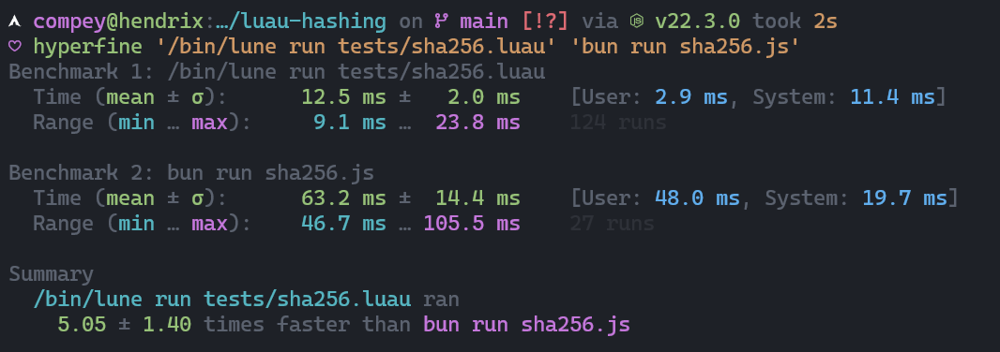
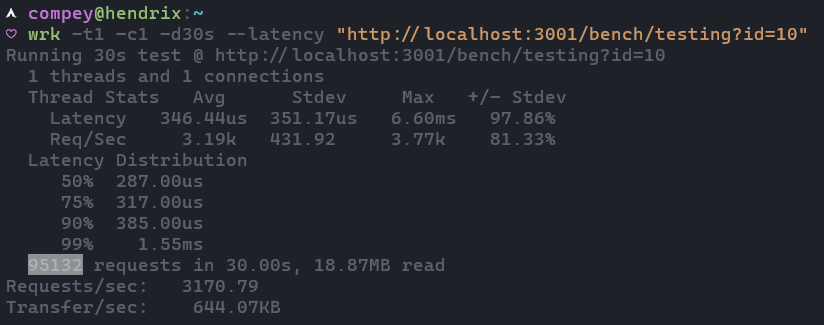

<!-- markdownlint-disable MD033 -->

Have you ever felt that you live in a loop? That’s how I feel - every time I open tech Twitter (*I refuse to call it X*). There are several “programming meme” accounts which seem to regurgitate the same few jokes on a regular basis, to the point that I’m convinced that they’re all AI. One of these overused meme formats is related to JavaScript, criticising its poor design choices which lead to various pitfalls a developer can face. I’ve never seen people offer solutions to these, so this blog post attempts to do so by proposing a promising alternative to JavaScript: [Luau](https://luau-lang.org).

## What is Luau?

Luau is a Lua derivative, which is fast, small and gradually typed, as described on their website. Luau was created at Roblox as a scalable alternative to Lua to run millions of times a day, on both clients and servers. It has generally been pushed aside as a “lego game language”, simply due to its ties to the Roblox platform, as Roblox has generally been tied to inexperienced and young game developers. Luau’s potential as a well-designed scripting language often goes unnoticed. In this blog post, I will attempt to compare Luau with JavaScript and hopefully showcase some of the benefits of Luau.

Luau has significantly diverged from Lua, with many performance improvements (including a separate bytecode format and compiler), type support, standard APIs like buffers, require aliases, and a lot more. Furthermore, Lua generally follows the ideology of “if it can be implemented in pure-lua, it should be, and doesn’t belong within the standard library”, which Luau does not follow much.

Compared to JavaScript, Luau does not face most of its well-documented pitfalls – see [wtfjs](https://github.com/denysdovhan/wtfjs). This is mainly because Luau inherits a lot of Lua’s good design decisions such as:

* No two different types can be equal
* Type coercion isn’t a thing, types must be converted explicitly
* Arithmetic and non-arithmetic operators aren’t of the same syntax
* Practically only one data type: the table, which can be used to implement virtually anything
* No semicolons or indents required!

### Types

A common flaw in JavaScript is the lack of types, which can prevent many developer mistakes before manual code review. Popular supersets of JavaScript with types include: TypeScript by Microsoft and Flow by Meta.

I will mostly be speaking about TypeScript, since I have more experience with it than the latter. Mainly, there are two glaring problems:

1. Types present a learning curve which aren’t present in other statically typed languages.
2. Types often overshadow the underlying business logic, since they present a large amount of logic on their own.

Both of these problems aren’t existent in Luau. In Luau, types are simple by design, while also providing sweet autocomplete and strong typechecking - adhering to the Lua philosophy of power through simplicity. Community-made tooling also tries to stick to this philosophy, leading to a strong competition to JavaScript in terms simplicity, which many prefer the language for.

A simple example of this in Luau types is this following which satisfies all types other than a specified one:

```ts
type ExcludeTypes<T, U> = T extends U ? never : T;
```

```lua
type ExcludeTypes<T> = ~T
```

:::note
The above type example isn’t available in stable Luau yet, and is a part of the revamped type solver, which is currently in development. It is expected to have a beta release soon.
:::

### Performance

There’s been a lot of talk about [Bun](https://bun.sh), a fast and modern JavaScript runtime for the serverside. Luau can often outperform Bun. I’m not one to believe in benchmarks, but a naive one would look like this:



For the Luau script, I’m using [Lune](https://github.com/lune-org/lune) as the runtime (Lune is similar to what Node accomplishes for JavaScript, it’s a script runtime with a well-designed standard library of APIs and other features) and [luau-hashing](https://github.com/dekkonot/luau-hashing) for the SHA-256 implementation. For Bun, I’m using their native crypto APIs. Lune is faster than Bun by **5 orders of magnitude**, and the benchmark is rigged against Lune, since we’re comparing a pure Luau implementation to a native zig API.

The [Lynx](https://lynx.land) web framework for Lune is **3 times faster** than Express on Node.



### Libraries and Ecosystem

Luau has a rapidly evolving community of developers, many of them creating awesome libraries and tools. This section expands on some Luau tooling and library equivalents for JavaScript developers.

### Tooling

1. ::github{repo="lune-org/lune"}
2. ::github{repo="seaofvoices/darklua"}
3. ::github{repo="kampfkarren/selene"}
4. ::github{repo="johnnymorganz/luau-lsp"}
5. ::github{repo="evaera/moonwave"}
6. ::github{repo="johnnymorganz/stylua"}

### Libraries

The Luau community has developed many libraries to make JavaScript developers feel at home! These include everything from Promise recreations, to entire ports of popular JavaScript libraries. To make the transition easier, there’s also a [set of polyfills for commonly used JS APIs](https://github.com/jsdotlua/luau-polyfill). Following are some libraries to try out in Luau:

1. ::github{repo="jsdotlua/jest-lua"}
2. ::github{repo="jsdotlua/react-lua"}
3. ::github{repo="DiscordLuau/discord-luau"}
4. ::github{repo="seaofvoices/luau-path"}
5. ::github{repo="nicell/lynx"}

…And many more which I haven't listed here!

:::note
It isn't currently possible for create websites using react-lua, it is currently only used for
frontend in Roblox game development; but web compatibility is being worked on.
:::

### Lune

As previously mentioned, Lune is a standalone Luau runtime, similar to Node (or more closely to Deno, since they share similarities). Although Luau is an embeddable language similar to Lua, Lune tries to create a fully-fledged, batteries-included scripting language. Lune provides world-class standard library APIs (referred to as builtins), with a low learning curve. Lune builtins attempt to be obvious, while also being powerful and performant.

Lune has a special focus on async I/O (anything which can be async, should be!) - so that you can leverage the performance of async computation without needing to worry about complex data types like promises. Lune accomplishes this by utilising a custom scheduler powered by [Tokio](https://tokio.rs), which handles parallel Luau and I/O API execution. Unlike in regular Lua, spawning async builtin APIs in a coroutine (or a task using the `@lune/task` builtin) will not block the main thread from executing, allowing for async code to run in parallel.

Lune also includes nice-to-have features, such as a build command supporting cross-compilation to package Lune scripts into executables which can be run without having Lune installed, an interactive REPL, executable scripts, and more to come.

> To get started with Lune, [check out the docs](https://lune-org.github.io/docs)!

</details>

## Conclusion

I highly recommend trying out Luau as an alternative to Bash, Python and JS scripts. I have converted many of my scripts to Luau, and it has given me a much nicer developer experience in the long run. Don't believe me? Take a look at the following scripts I use to package compiled Rust binaries into zip files, both in Luau and Bash:

```lua
--> Packages a target-specific Rust binary into a zip file

local process = require("@lune/process")
local serde = require("@lune/serde")
local fs = require("@lune/fs")

type CargoDependencies = { [string]: (number | {}) }
type CargoToml = {
    package: {
        build: string,
        version: string,
        name: string,
        edition: string,
    },
    ["build-dependencies"]: CargoDependencies,
    dependencies: CargoDependencies,
}

local function execute(dir: string, command: string, ...): ()
    local args = {...}
    print(`--------> {command} {table.concat(args, " ")}`)

    local child = process.spawn(command, args, {
        shell = true,
        stdio = "forward",
        cwd = dir
    })

    print()

    if not child.ok then
        process.exit(child.code)
    end
end

function main(): number
    execute(process.cwd, "just", "build", "--release")

    local cargoToml: CargoToml = serde.decode("toml", fs.readFile("Cargo.toml"))
    local fileExt: ".exe" | "" = if process.os == "windows" then ".exe" else ""
    local zipName = `{cargoToml.package.name}-{cargoToml.package.version}-{process.arch}-{process.os}.zip`
    local fileName = `fox32asm{fileExt}`
    local command = {}

    if process.os == "windows" then
        command = {
            "7z.exe",
            "a",
            "-tzip",
            zipName,
            fileName
        }
    elseif process.os == "linux" then
        command = {
            "zip", 
            zipName, 
            fileName
        }
    end
    
    execute(
        `{process.cwd}/target/release`,
        table.unpack(command)
    )
    
    return 0
end

return process.exit(main())
```

```bash
# !/usr/bin/env bash
set -euo pipefail
rm -rf staging
rm -rf release.zip
mkdir -p staging
cp "target/{{TARGET_TRIPLE}}/release/{{BIN_NAME}}{{EXT}}" staging/
cd staging
if [ "{{os_family()}}" = "windows" ]; then
    7z a ../release.zip *
else
    chmod +x {{BIN_NAME}}
    zip ../release.zip*
fi
cd "{{CWD}}"
rm -rf staging
```

</td>
</table>

Not only is the Lune version cross-platform and much easier to read and write, it is also convenient to use, since the bash script requires the user to manually input information.

**All I ask you is to try something a little different the next time you start a new side-project, something a little bit more Hawaiian!** :)

<sub>*The name “Luau” is inherited from a Hawaiian word meaning “An elaborate Hawaiian feast featuring traditional foods and entertainment”*</sub>
